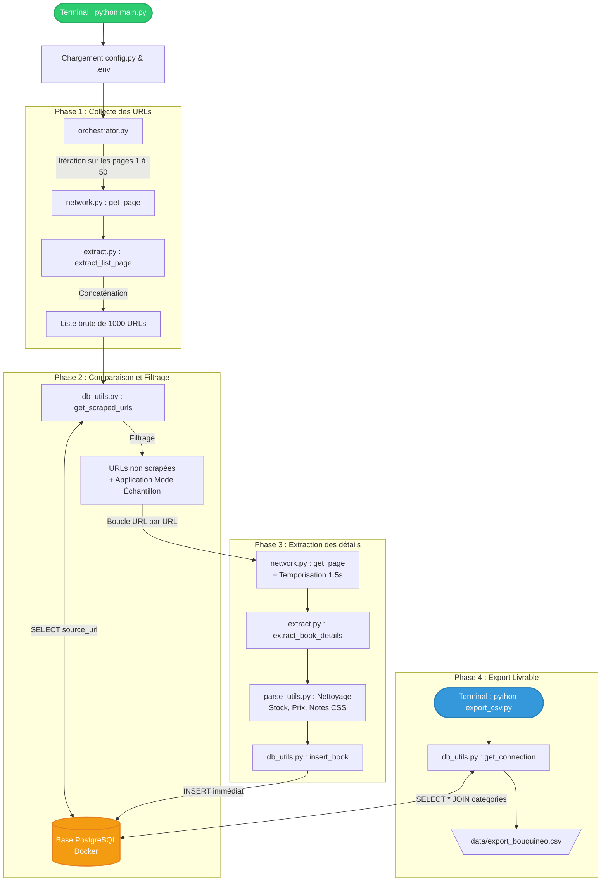

# Flux d'exécution du Scraper Bouquineo

Voici le diagramme logique représentant la chaîne d'actions des différents scripts que nous avons créés :

### Explications des étapes clés :

1. **Phase 1** : L'orchestrateur demande au réseau (`network.py`) de télécharger les pages de listes (de 1 à 50) et confie le code HTML à `extract.py` pour isoler uniquement les liens menant aux fiches produits.
2. **Phase 2 (La reprise sur erreur)** : Plutôt que de scraper aveuglément les 1000 liens, le script interroge la base de données. Il retire de sa liste toutes les fiches qui s'y trouvent déjà.
3. **Phase 3 (L'exécution sécurisée)** : Le script visite chaque livre manquant un par un, attend poliment 1,5 seconde, extrait toutes les données fines (UPC, stock réel, taxes), convertit les notes textuelles en chiffres avec `parse_utils.py`, et **sauvegarde immédiatement** en base pour ne rien perdre en cas de crash (coupure internet, arrêt manuel).
4. **Phase 4** : Action indépendante (à lancer en fin de projet) qui va lire la base de données finalisée pour générer le fichier CSV attendu par le jury.
